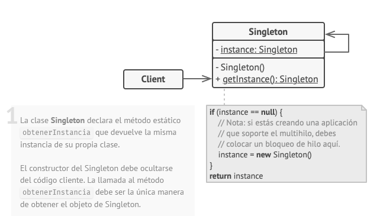

# Arquitectura de software

**Patrón arquitectónico:** Modelo vista controlador (MVC).

**Patrón de diseño:** Singleton

**Estructura:**

En este ejemplo el patrón de diseño está encargado de establecer una única instancia para la conexión a la base de datos. Se encuentra dentro de la carpeta *model* ya que es independiente a los controladores. Un ejemplo más claro se ve cuando por algún motivo se quiera cambiar la base de datos, al cambiarse solo debe modificarse la conexión en el archivo, sin tener que cambiarlos en todos los controladores que utilicen esta conexión cumpliendo así la letra S de los principios SOLID  Single responsibility principle (SRP). 

------

#### 🎗Autor

👨‍💻 John Edward González Esparragoza

 